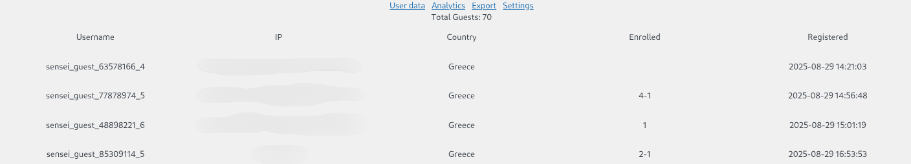
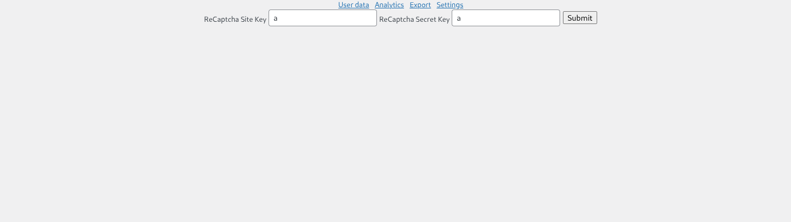
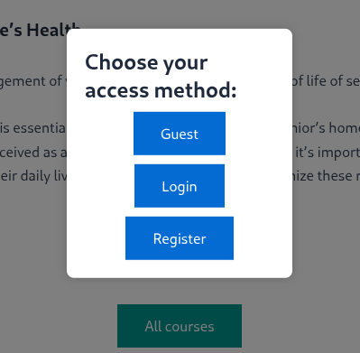

[](https://intermediakt.org)
[](https://www.php.net/downloads.php)
[](https://wordpress.org/download/releases/6-7/)
[](https://senseilms.com)

## Author
Created by [Charalambos Rentoumis](https://github.com/5skr0ll3r)

## Why:
Triple A Sensei enables triple access, it enables you to have at the same time login/register and guest access to all of your courses

## ContactUs
For more information/feedback etc. contact us in
techsupport@intermediakt.org
charalambos@intermediakt.org 


### User Data:

### Analytics

### Export

### Settings


# Docs:

```
.
└── Triple_A
		├── hooks
		│		├── actions.php
		│		├── filters.php
		│		└── index.php
		├── includes
		│		├── activate.php
		│		├── captcha.php
		│		├── db-api.php
		│		├── deactivate.php
		│		├── export.php
		│		├── index.php
		│		└── my-sensei-stuff.php
		├── index.php
		├── templates
		│		├── admin
		│		│		├── admin_panel_charts.php
		│		│		├── admin_panel_entries.php
		│		│		├── admin_panel_export.php
		│		│		├── admin_panel.php
		│		│		├── admin_panel_settings.php
		│		│		└── index.php
		│		├── index.php
		│		└── popup.php
		└── triple-a-sensei.php
```
## Entry
###	triple-a-sensei.php
- **Description:** 

## Hooks
### actions.php
- **Description:** Contains all the actions to be registered. 
### filters.php
- **Description:** Contains all the filters to be registered.

## Includes
### activate.php
- **Description:** Contains the activation function for the plugin initiating also the **Triple_A_Sensei_DB_API** static variables and setting the tables.
### deactivate.php
- **Description:** Contains the deactivation function for the plugin.
### captcha.php
- **Description:** Contains the captcha_v3 code to help block bots from accessing your service.
### db-api.php
- **Description:** Contains the api to communicate with the database.
### export.php
- **Description:** Contains the export logic for the guest users data.
### my-sensei-stuff.php
- **Description:** Contains **My_Sensei_Stuff** which includes the methods required to enable the triple access.

## Templates
### popup.php
- **Description:** Contains the code for the popup option for login/register or guest access.

## Templates/Admin
### admin_panel.php
- **Description:** Contains the base code for the admin menu.
### admin_panel_entries.php
- **Description** Contains the code to display all the guest user information.
### admin_panel_charts.php
- **Description:** Contains the code to display basic analytics (currently only based on countries in pie form).
### admin_panel_export.php
- **Description:** Contains the form to submit the export request (exports all the guest data in an 'excel' file).
### admin_panel_settings.php
- **Description:** Contains the form to insert your captcha site and secret key to connect to the google api.


# Snippet

if you prefer a simpler way of doing it, here is also a code snippet that achieves the "triple A" access but without tracking/botSafety/AdminPanel
it only contains the popup
[Snippet.php](./snippet.php)

